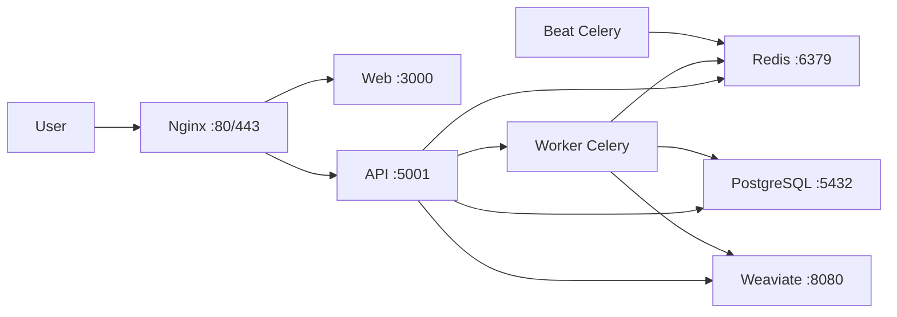
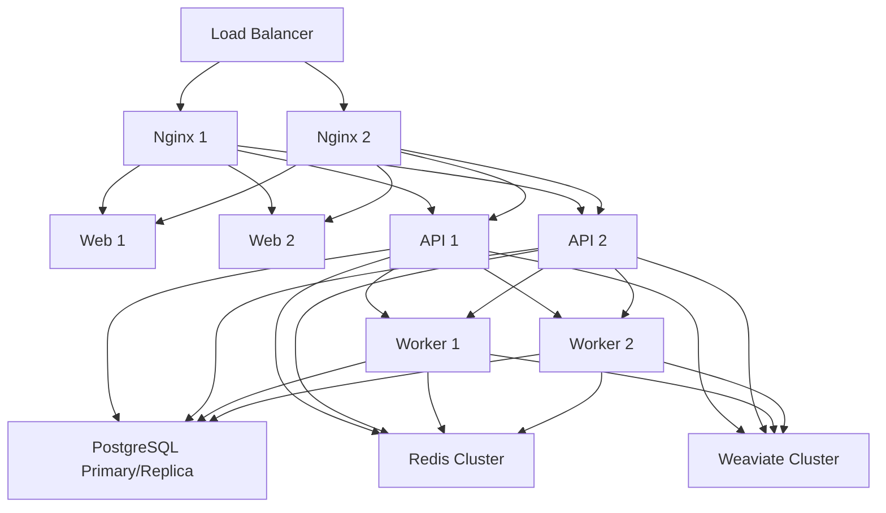
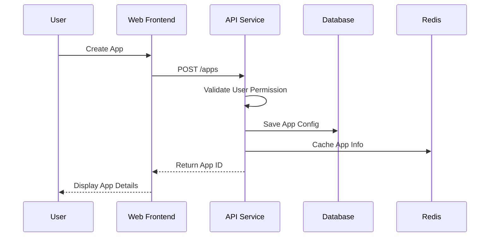
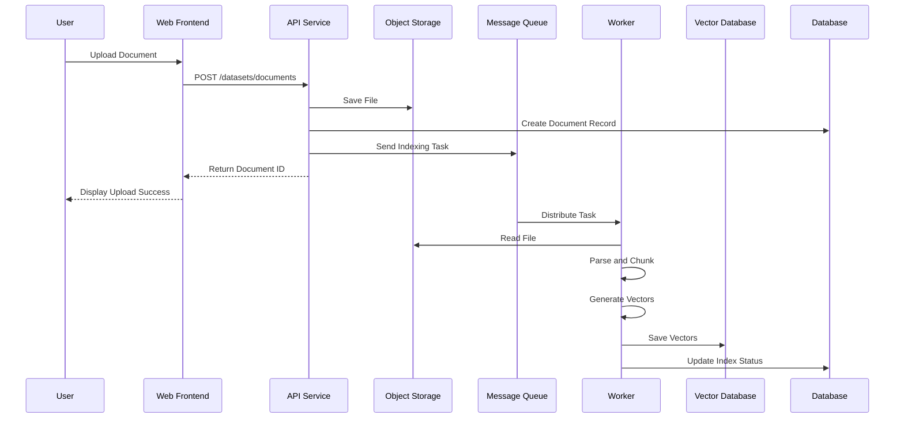
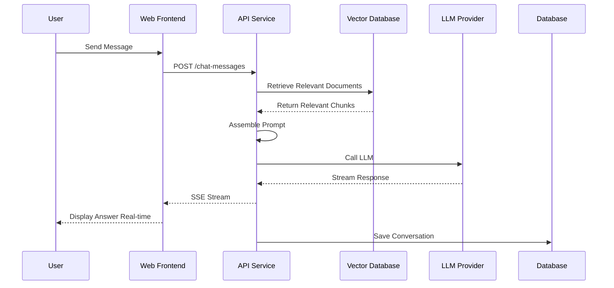

# Dify Architecture Documentation

## Project Overview

Dify is an open-source LLM application development platform that provides an intuitive interface combining AI Agent workflows, RAG (Retrieval-Augmented Generation) pipelines, agent capabilities, model management, and observability features.

## System Architecture Diagram

```mermaid
graph TB
    subgraph "Frontend Layer"
        A[Next.js Web App]
        A1[React Components]
        A2[State Management<br/>Zustand/Jotai]
        A3[UI Components<br/>Tailwind CSS]
        A --> A1
        A --> A2
        A --> A3
    end
    
    subgraph "API Gateway Layer"
        B[Nginx Reverse Proxy]
        B --> B1[SSL/TLS Termination]
        B --> B2[Load Balancing]
        B --> B3[Static Asset Serving]
    end
    
    subgraph "Application Layer"
        C[Flask API Service]
        C --> C1[Controllers<br/>Request Handling]
        C --> C2[Services<br/>Business Logic]
        C --> C3[Core<br/>Domain Logic]
        
        D[Celery Worker]
        D --> D1[Async Task Processing]
        D --> D2[Document Indexing]
        D --> D3[Workflow Execution]
        
        E[Celery Beat]
        E --> E1[Scheduled Tasks]
    end
    
    subgraph "Core Modules"
        F[Model Manager]
        G[Workflow Engine]
        H[RAG Pipeline]
        I[Agent System]
        J[Prompt Engine]
        K[File Processor]
    end
    
    subgraph "Data Storage Layer"
        L[(PostgreSQL/MySQL<br/>Relational DB)]
        M[(Redis<br/>Cache/Queue)]
        N[(Vector Database)]
        N --> N1[Weaviate]
        N --> N2[Milvus]
        N --> N3[Qdrant]
        N --> N4[Others]
        
        O[Object Storage]
        O --> O1[Local Storage]
        O --> O2[S3-Compatible]
        O --> O3[Azure Blob]
        O --> O4[Google Cloud Storage]
    end
    
    subgraph "External Services"
        P[LLM Providers]
        P --> P1[OpenAI]
        P --> P2[Azure OpenAI]
        P --> P3[Anthropic Claude]
        P --> P4[Google Gemini]
        P --> P5[Open Source Models]
        
        Q[Third-party Tools]
        Q --> Q1[Google Search]
        Q --> Q2[DALL·E]
        Q --> Q3[Stable Diffusion]
        Q --> Q4[WolframAlpha]
    end
    
    subgraph "Observability"
        R[OpenTelemetry]
        S[Sentry Error Tracking]
        T[Log Aggregation]
        U[Metrics Monitoring<br/>Prometheus/Grafana]
    end
    
    A -->|HTTP/HTTPS| B
    B -->|Forward Request| C
    C -->|Task Queue| M
    M -->|Messages| D
    C -->|Data Persistence| L
    C -->|Caching| M
    C -->|Vector Search| N
    C -->|File Storage| O
    C -->|Model Calls| P
    C -->|Tool Calls| Q
    D -->|Data Access| L
    D -->|Vector Storage| N
    D -->|File Access| O
    C --> F
    C --> G
    C --> H
    C --> I
    C --> J
    C --> K
    C -.Monitoring.-> R
    C -.Error Tracking.-> S
    C -.Logging.-> T
    C -.Metrics.-> U
    
    style A fill:#e1f5ff
    style B fill:#fff4e6
    style C fill:#e8f5e9
    style D fill:#e8f5e9
    style E fill:#e8f5e9
    style L fill:#fce4ec
    style M fill:#fce4ec
    style N fill:#fce4ec
    style O fill:#fce4ec
    style P fill:#f3e5f5
    style Q fill:#f3e5f5
```

## Module Functionality

### 1. Frontend Layer

#### Next.js Web Application
- **Main Functions**: Provides user interface for console and applications
- **Tech Stack**: Next.js 16.x, React 19.x, TypeScript
- **Core Components**:
  - **Workflow Editor**: Visual orchestration of AI workflows
  - **Prompt IDE**: Prompt engineering and testing
  - **App Management**: Create, configure, and manage AI applications
  - **Dataset Management**: Knowledge base upload and management
  - **Analytics Dashboard**: Application performance and usage monitoring

#### State Management
- **Zustand**: Lightweight global state management
- **Jotai**: Atomic state management
- **TanStack Query**: Server state management and data synchronization

#### UI Framework
- **Tailwind CSS**: Styling system
- **Headless UI**: Unstyled UI components
- **ReactFlow**: Workflow graph editing
- **Lexical**: Rich text editor

### 2. API Gateway Layer

#### Nginx
- **Functions**:
  - SSL/TLS termination and HTTPS support
  - Reverse proxy and load balancing
  - Static asset serving
  - Request routing and rewriting
  - CORS configuration
  - Compression and caching

### 3. Application Layer

#### Flask API Service
- **Architecture Pattern**: Domain-Driven Design (DDD) + Clean Architecture
- **Layer Structure**:
  - **Controllers**: HTTP request handling and response serialization
  - **Services**: Business logic coordination
  - **Core**: Core domain logic
  - **Models**: Data model definitions
  - **Repositories**: Data access abstraction

#### Celery Worker
- **Main Tasks**:
  - Document processing and vectorization
  - Workflow asynchronous execution
  - Email sending
  - Data cleanup and archiving
  - Plugin task execution

#### Celery Beat
- **Scheduled Tasks**:
  - Cleanup expired logs
  - Data backup
  - Usage statistics aggregation
  - Health checks

### 4. Core Modules

#### Model Manager
- **Functions**:
  - Unified LLM access interface
  - Support for 100+ model providers
  - Model credential management
  - Load balancing and failover
  - Token usage tracking

#### Workflow Engine
- **Functions**:
  - Visual workflow orchestration
  - Node types: LLM, Knowledge Retrieval, Code Execution, Conditional Branch, Loop
  - Variable passing and transformation
  - Error handling and retry
  - Workflow version management

#### RAG Pipeline
- **Functions**:
  - Document parsing (PDF, DOCX, PPT, TXT, etc.)
  - Text chunking strategies
  - Vectorization and indexing
  - Hybrid search (vector + keyword)
  - Re-ranking
  - Context assembly

#### Agent System
- **Functions**:
  - Function Calling-based agents
  - ReAct-based agents
  - 50+ built-in tools
  - Custom tool integration
  - Multi-turn dialogue management

#### Prompt Engine
- **Functions**:
  - Prompt template management
  - Variable injection and rendering
  - Multi-model adaptation
  - Prompt version control

#### File Processor
- **Functions**:
  - File upload and validation
  - Format conversion
  - Image processing (OCR, description generation)
  - Audio transcription
  - File preview generation

### 5. Data Storage Layer

#### Relational Database
- **Supported Options**:
  - PostgreSQL (recommended)
  - MySQL
  - OceanBase
- **Stored Content**:
  - Application configurations
  - User data
  - Conversation history
  - Workflow definitions
  - Audit logs

#### Redis
- **Usage**:
  - Session storage
  - Cache layer
  - Celery message queue
  - Distributed locks
  - Rate limiting counters

#### Vector Database
- **Supported Options**:
  - Weaviate
  - Milvus
  - Qdrant
  - PostgreSQL pgvector
  - OpenSearch
  - ChromaDB
  - Others
- **Stored Content**:
  - Document vectors
  - Vector indexes
  - Metadata

#### Object Storage
- **Supported Options**:
  - Local filesystem
  - S3-compatible storage
  - Azure Blob Storage
  - Google Cloud Storage
  - Alibaba Cloud OSS
  - Tencent Cloud COS
- **Stored Content**:
  - Uploaded files
  - Generated images
  - Exported data

### 6. External Services

#### LLM Providers
- OpenAI (GPT-3.5, GPT-4, GPT-4 Turbo)
- Anthropic (Claude series)
- Google (Gemini series)
- Azure OpenAI
- Open-source models (Llama, Mistral, etc.)
- Self-hosted models

#### Integrated Tools
- Google Search
- DALL·E image generation
- Stable Diffusion
- WolframAlpha
- Web scraping tools
- API calling tools

### 7. Observability

#### OpenTelemetry
- Distributed tracing
- Metrics collection
- Log correlation

#### Sentry
- Error tracking
- Performance monitoring
- User feedback

#### Logging System
- Structured logging
- Log aggregation
- Log analysis

#### Metrics Monitoring
- Prometheus metrics collection
- Grafana visualization
- Alert rules

## Core Dependencies

### Backend (Python)

#### Web Framework
- **Flask 3.1.x**: Web application framework
- **Flask-CORS**: Cross-origin resource sharing
- **Flask-Login**: User authentication
- **Flask-Migrate**: Database migrations
- **Flask-SQLAlchemy**: ORM integration
- **Flask-RESTx**: REST API documentation
- **Gunicorn**: WSGI server
- **Gevent**: Coroutine support

#### Database
- **SQLAlchemy 2.0.x**: ORM framework
- **psycopg2-binary**: PostgreSQL driver
- **Redis 6.1.x**: Redis client

#### Task Queue
- **Celery 5.5.x**: Distributed task queue
- **APScheduler**: Scheduled task scheduler

#### AI/ML
- **transformers 4.56.x**: Hugging Face Transformers
- **tiktoken**: OpenAI tokenizer
- **langsmith**: LangChain monitoring
- **langfuse**: LLM tracing
- **litellm 1.77.x**: Unified LLM interface

#### Vector Database Clients
- **weaviate-client 4.17.x**: Weaviate client

#### Document Processing
- **pypdfium2**: PDF processing
- **python-docx**: Word document processing
- **unstructured**: Unstructured data processing
- **beautifulsoup4**: HTML parsing
- **readabilipy**: Web content extraction

#### Data Processing
- **pandas 2.2.x**: Data analysis
- **numpy 1.26.x**: Numerical computation
- **openpyxl**: Excel processing

#### HTTP Clients
- **httpx**: Async HTTP client
- **boto3**: AWS SDK (S3, etc.)

#### Validation and Serialization
- **Pydantic 2.11.x**: Data validation
- **jsonschema**: JSON Schema validation

#### Monitoring and Tracing
- **opentelemetry-***: OpenTelemetry components
- **sentry-sdk**: Sentry integration
- **arize-phoenix-otel**: Phoenix tracing

#### Others
- **PyYAML**: YAML processing
- **python-dotenv**: Environment variable management
- **PyJWT**: JWT authentication
- **pycryptodome**: Encryption
- **croniter**: Cron expression parsing

### Frontend (JavaScript/TypeScript)

#### Framework and Runtime
- **Next.js 16.1.x**: React framework
- **React 19.2.x**: UI library
- **TypeScript 5.9.x**: Type system

#### State Management
- **zustand 5.0.x**: State management
- **jotai 2.16.x**: Atomic state
- **immer 11.1.x**: Immutable data
- **@tanstack/react-query 5.90.x**: Server state

#### UI Components
- **@headlessui/react**: Unstyled components
- **@heroicons/react**: Icons
- **@remixicon/react**: Icons
- **tailwind-merge**: Tailwind utilities
- **class-variance-authority**: Variant styling
- **clsx**: Class name utilities

#### Editors
- **lexical**: Rich text editor
- **@monaco-editor/react**: Monaco code editor
- **react-markdown**: Markdown rendering

#### Workflow and Graphics
- **reactflow 11.11.x**: Workflow graph editing
- **elkjs**: Graph layout algorithm
- **@svgdotjs/svg.js**: SVG manipulation
- **mermaid**: Flowchart rendering

#### Forms and Input
- **@tanstack/react-form**: Form management
- **react-textarea-autosize**: Auto-resizing textarea
- **react-18-input-autosize**: Auto-resizing input

#### Data Visualization
- **echarts**: Chart library
- **echarts-for-react**: React wrapper

#### File and Media
- **react-easy-crop**: Image cropping
- **html-to-image**: HTML to image
- **qrcode.react**: QR code generation
- **js-audio-recorder**: Audio recording
- **lamejs**: MP3 encoding

#### Utilities
- **es-toolkit**: Utility functions
- **ahooks**: React Hooks
- **dayjs**: Date handling
- **decimal.js**: Precise math
- **dompurify**: XSS protection
- **zod**: Data validation
- **ky**: HTTP client

#### API Integration
- **@orpc/client**: oRPC client
- **@orpc/contract**: API contract
- **@octokit/core**: GitHub API

#### Internationalization
- **i18next**: i18n framework
- **react-i18next**: React integration

#### Monitoring and Analytics
- **@sentry/react**: Error tracking
- **@amplitude/analytics-browser**: User analytics

#### Development Tools
- **eslint**: Code linting
- **vitest**: Testing framework
- **@testing-library/react**: React testing
- **storybook**: Component development

### Infrastructure Components

#### Containerization
- **Docker**: Container runtime
- **Docker Compose**: Multi-container orchestration

#### Web Server
- **Nginx**: Reverse proxy and web server

#### Database
- **PostgreSQL 15+**: Relational database
- **Redis 6+**: Cache and message queue

#### Vector Database (Choose one)
- **Weaviate**: Vector database
- **Milvus**: Vector database
- **Qdrant**: Vector database

#### Object Storage (Choose one)
- **MinIO**: S3-compatible storage
- **AWS S3**: Cloud object storage
- **Azure Blob Storage**: Cloud object storage
- **Google Cloud Storage**: Cloud object storage

## Deployment Architecture

### Single-Server Deployment

### High Availability Deployment

## Data Flow

### User Creates AI Application

### Document Upload and Indexing

### AI Conversation Flow

## Security Architecture

### Authentication and Authorization
- JWT Token authentication
- Role-Based Access Control (RBAC)
- API key management
- OAuth2 integration

### Data Security
- Transport encryption (TLS/SSL)
- Data at rest encryption
- Sensitive information masking
- Audit logging

### Network Security
- CORS configuration
- SSRF protection
- XSS protection
- SQL injection protection
- Rate limiting

## Scalability Design

### Horizontal Scaling
- Stateless API service design
- Dynamic worker node scaling
- Database read/write separation
- Cache sharding

### Plugin System
- Custom model providers
- Custom tools
- Custom document loaders
- Webhook integration

## Performance Optimization

### Caching Strategy
- Redis multi-layer caching
- Static asset CDN
- Vector caching
- Query result caching

### Asynchronous Processing
- Long-running task asynchronization
- Message queue decoupling
- Batch processing optimization

### Database Optimization
- Index optimization
- Query optimization
- Connection pool management
- Pagination queries

## Monitoring Metrics

### Business Metrics
- Number of applications
- Number of users
- Number of conversations
- Token usage

### Technical Metrics
- API response time
- Error rate
- Throughput
- Resource utilization

### Cost Metrics
- LLM API costs
- Storage costs
- Compute resource costs

## Summary

Dify adopts a modern microservices architecture with clear layered design achieving high cohesion and low coupling. The system supports multiple database and storage options, allowing flexible configuration based on actual needs. Comprehensive monitoring and observability ensure stable system operation. Modular design makes the system easy to extend and maintain.
