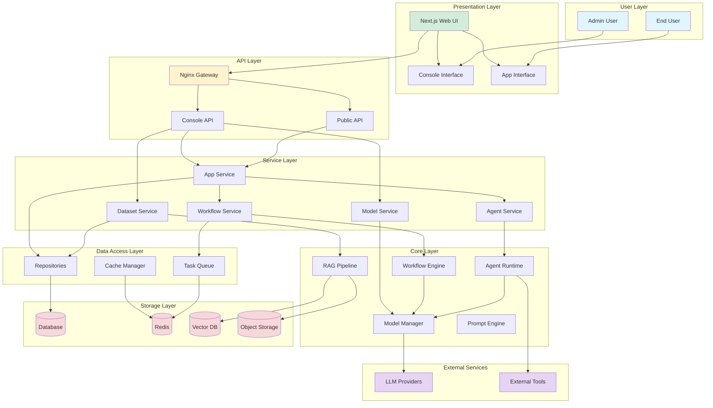
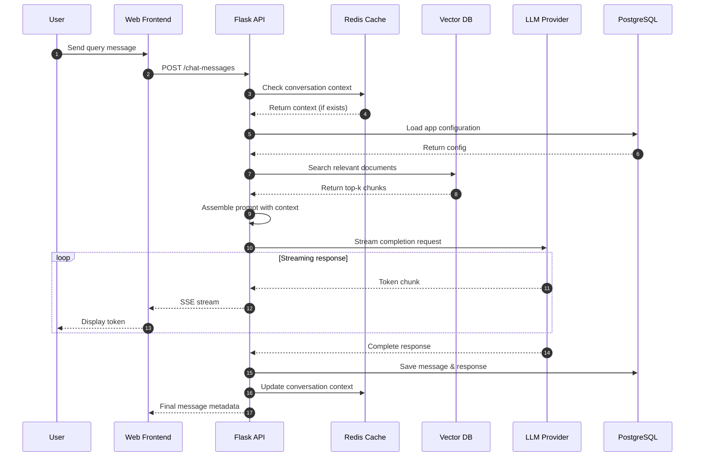
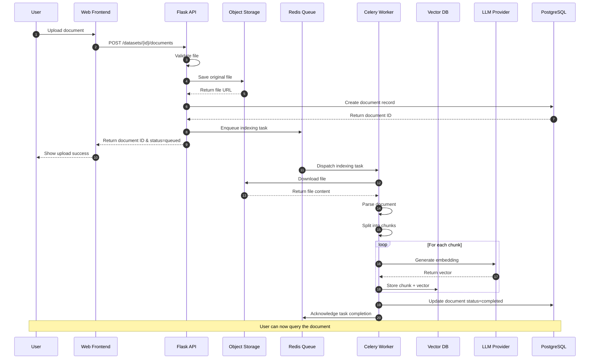
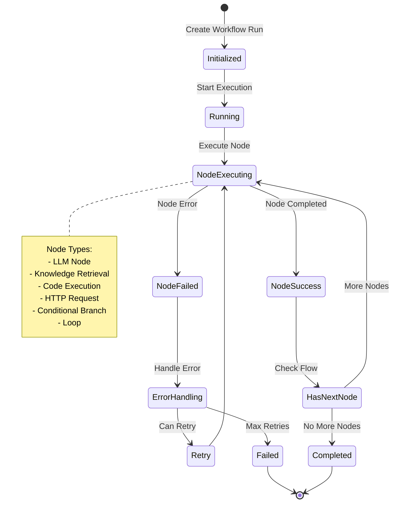
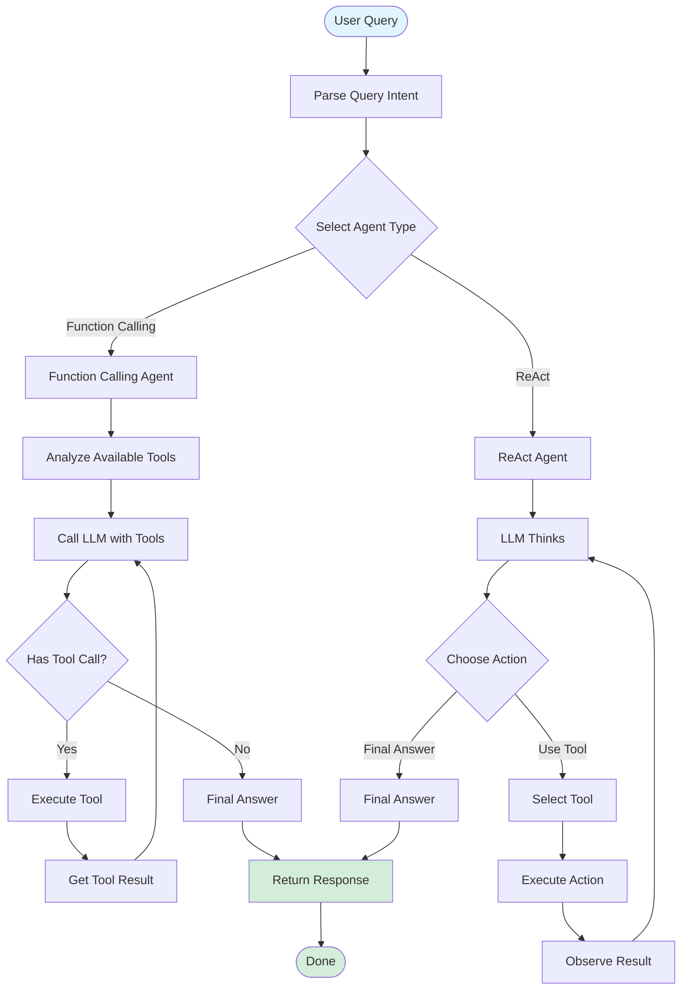
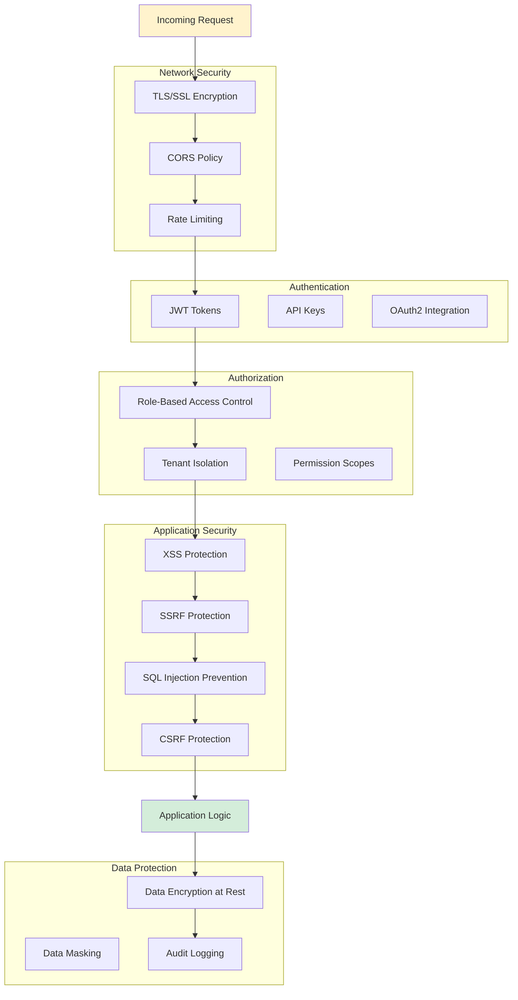

# Dify Architecture Diagrams

This directory contains visual architecture diagrams for the Dify project.

## Available Diagrams

### 1. System Architecture
See the complete system architecture in:
- [English Version](../ARCHITECTURE.md)
- [中文版本](../zh-CN/ARCHITECTURE.md)

### 2. Mermaid Diagrams

All diagrams are created using Mermaid syntax and can be viewed in:
- GitHub (native support)
- VS Code (with Mermaid extension)
- Online Mermaid editors

### 3. Component Interaction



### 4. Data Flow - RAG Query



### 5. Data Flow - Document Indexing



### 6. Workflow Execution



### 7. Agent Decision Flow



### 8. Security Layers



## How to View

### GitHub
All Mermaid diagrams render automatically in GitHub's web interface.

### VS Code
Install the "Markdown Preview Mermaid Support" extension:
```
ext install bierner.markdown-mermaid
```

### Online Editors
- [Mermaid Live Editor](https://mermaid.live/)
- [Mermaid Chart](https://www.mermaidchart.com/)

## Export as Images

To export diagrams as PNG/SVG:

1. Use Mermaid CLI:
```bash
npm install -g @mermaid-js/mermaid-cli
mmdc -i diagram.md -o diagram.png
```

2. Use online editor:
   - Paste code into [Mermaid Live Editor](https://mermaid.live/)
   - Click "Export" button
   - Choose PNG or SVG format

## Contributing

When adding new diagrams:
1. Use consistent styling
2. Add clear labels and descriptions
3. Keep diagrams focused on specific aspects
4. Update this README with new diagram descriptions
