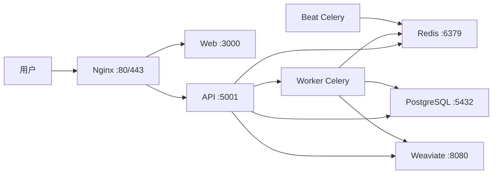
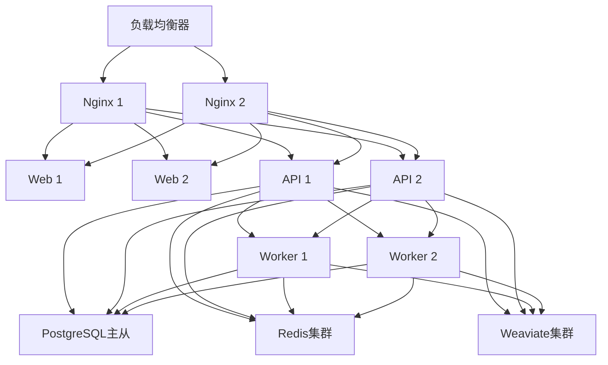
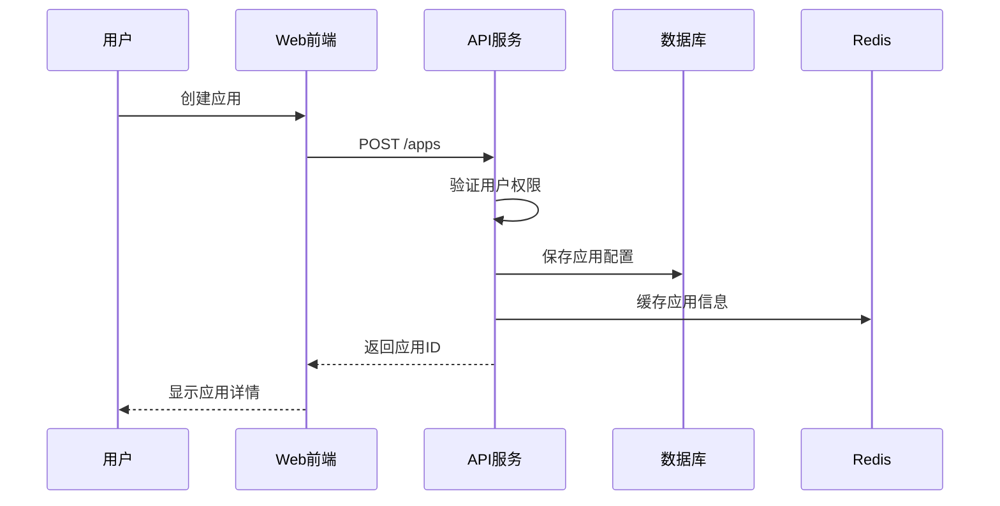
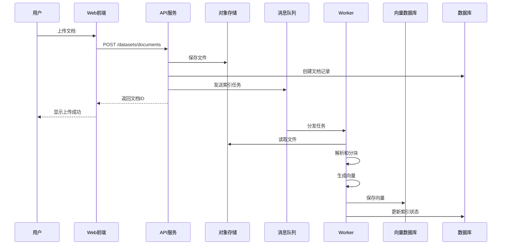
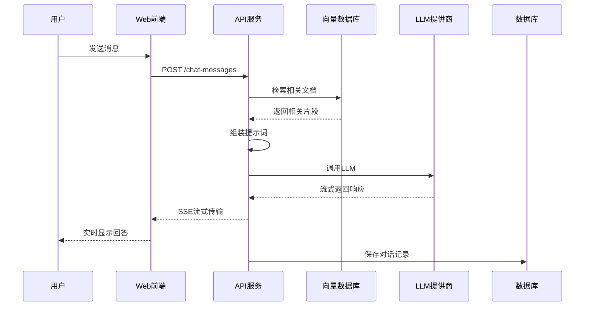

# Dify 项目架构文档

## 项目概述

Dify 是一个开源的 LLM 应用开发平台，提供直观的界面，结合了 Agent AI 工作流、RAG（检索增强生成）流水线、Agent 能力、模型管理和可观测性功能。

## 系统架构图

```mermaid
graph TB
    subgraph "前端层 Frontend Layer"
        A[Next.js Web应用]
        A1[React组件]
        A2[状态管理<br/>Zustand/Jotai]
        A3[UI组件<br/>Tailwind CSS]
        A --> A1
        A --> A2
        A --> A3
    end
    
    subgraph "API网关层 API Gateway Layer"
        B[Nginx反向代理]
        B --> B1[SSL/TLS终止]
        B --> B2[负载均衡]
        B --> B3[静态资源服务]
    end
    
    subgraph "应用层 Application Layer"
        C[Flask API服务]
        C --> C1[Controllers<br/>请求处理]
        C --> C2[Services<br/>业务逻辑]
        C --> C3[Core<br/>核心功能]
        
        D[Celery Worker]
        D --> D1[异步任务处理]
        D --> D2[文档索引]
        D --> D3[工作流执行]
        
        E[Celery Beat]
        E --> E1[定时任务调度]
    end
    
    subgraph "核心功能模块 Core Modules"
        F[模型管理<br/>Model Manager]
        G[工作流引擎<br/>Workflow Engine]
        H[RAG管道<br/>RAG Pipeline]
        I[Agent系统<br/>Agent System]
        J[提示词引擎<br/>Prompt Engine]
        K[文件处理<br/>File Processor]
    end
    
    subgraph "数据存储层 Data Storage Layer"
        L[(PostgreSQL/MySQL<br/>关系数据库)]
        M[(Redis<br/>缓存/队列)]
        N[(向量数据库<br/>Vector Store)]
        N --> N1[Weaviate]
        N --> N2[Milvus]
        N --> N3[Qdrant]
        N --> N4[其他向量DB]
        
        O[对象存储<br/>Object Storage]
        O --> O1[本地存储]
        O --> O2[S3兼容]
        O --> O3[Azure Blob]
        O --> O4[Google Cloud Storage]
    end
    
    subgraph "外部服务 External Services"
        P[LLM提供商]
        P --> P1[OpenAI]
        P --> P2[Azure OpenAI]
        P --> P3[Anthropic Claude]
        P --> P4[Google Gemini]
        P --> P5[开源模型]
        
        Q[第三方工具]
        Q --> Q1[Google搜索]
        Q --> Q2[DALL·E]
        Q --> Q3[Stable Diffusion]
        Q --> Q4[WolframAlpha]
    end
    
    subgraph "监控可观测 Observability"
        R[OpenTelemetry]
        S[Sentry错误追踪]
        T[日志聚合]
        U[指标监控<br/>Prometheus/Grafana]
    end
    
    A -->|HTTP/HTTPS| B
    B -->|请求转发| C
    C -->|任务队列| M
    M -->|消息| D
    C -->|数据持久化| L
    C -->|缓存| M
    C -->|向量检索| N
    C -->|文件存储| O
    C -->|调用模型| P
    C -->|调用工具| Q
    D -->|数据访问| L
    D -->|向量存储| N
    D -->|文件访问| O
    C --> F
    C --> G
    C --> H
    C --> I
    C --> J
    C --> K
    C -.监控.-> R
    C -.错误追踪.-> S
    C -.日志.-> T
    C -.指标.-> U
    
    style A fill:#e1f5ff
    style B fill:#fff4e6
    style C fill:#e8f5e9
    style D fill:#e8f5e9
    style E fill:#e8f5e9
    style L fill:#fce4ec
    style M fill:#fce4ec
    style N fill:#fce4ec
    style O fill:#fce4ec
    style P fill:#f3e5f5
    style Q fill:#f3e5f5
```

## 模块功能说明

### 1. 前端层 (Frontend Layer)

#### Next.js Web应用
- **主要功能**：提供用户交互界面，包括控制台和应用界面
- **技术栈**：Next.js 16.x, React 19.x, TypeScript
- **核心组件**：
  - **工作流编辑器**：可视化编排AI工作流
  - **提示词工程IDE**：提示词编写和测试
  - **应用管理界面**：创建、配置和管理AI应用
  - **数据集管理**：知识库的上传和管理
  - **分析监控面板**：应用性能和使用情况监控

#### 状态管理
- **Zustand**: 轻量级全局状态管理
- **Jotai**: 原子化状态管理
- **TanStack Query**: 服务端状态管理和数据同步

#### UI框架
- **Tailwind CSS**: 样式系统
- **Headless UI**: 无样式UI组件
- **ReactFlow**: 工作流图形编辑
- **Lexical**: 富文本编辑器

### 2. API网关层 (API Gateway Layer)

#### Nginx
- **功能**：
  - SSL/TLS终止和HTTPS支持
  - 反向代理和负载均衡
  - 静态资源服务
  - 请求路由和重写
  - CORS配置
  - 压缩和缓存

### 3. 应用层 (Application Layer)

#### Flask API服务
- **架构模式**：领域驱动设计 (DDD) + 清洁架构
- **层次结构**：
  - **Controllers**: HTTP请求处理和响应序列化
  - **Services**: 业务逻辑协调
  - **Core**: 核心领域逻辑
  - **Models**: 数据模型定义
  - **Repositories**: 数据访问抽象

#### Celery Worker
- **主要任务**：
  - 文档处理和向量化
  - 工作流异步执行
  - 邮件发送
  - 数据清理和归档
  - 插件任务执行

#### Celery Beat
- **定时任务**：
  - 清理过期日志
  - 数据备份
  - 使用统计汇总
  - 健康检查

### 4. 核心功能模块 (Core Modules)

#### 模型管理 (Model Manager)
- **功能**：
  - 统一的LLM访问接口
  - 支持100+模型提供商
  - 模型凭证管理
  - 负载均衡和故障转移
  - Token使用追踪

#### 工作流引擎 (Workflow Engine)
- **功能**：
  - 可视化工作流编排
  - 节点类型：LLM、知识检索、代码执行、条件分支、循环
  - 变量传递和转换
  - 错误处理和重试
  - 工作流版本管理

#### RAG管道 (RAG Pipeline)
- **功能**：
  - 文档解析（PDF, DOCX, PPT, TXT等）
  - 文本分块策略
  - 向量化和索引
  - 混合检索（向量+关键词）
  - 重排序(Re-ranking)
  - 上下文组装

#### Agent系统 (Agent System)
- **功能**：
  - 基于Function Calling的Agent
  - 基于ReAct的Agent
  - 50+内置工具
  - 自定义工具集成
  - 多轮对话管理

#### 提示词引擎 (Prompt Engine)
- **功能**：
  - 提示词模板管理
  - 变量注入和渲染
  - 多模型适配
  - 提示词版本控制

#### 文件处理 (File Processor)
- **功能**：
  - 文件上传和验证
  - 格式转换
  - 图片处理（OCR、描述生成）
  - 音频转录
  - 文件预览生成

### 5. 数据存储层 (Data Storage Layer)

#### 关系数据库
- **支持选项**：
  - PostgreSQL (推荐)
  - MySQL
  - OceanBase
- **存储内容**：
  - 应用配置
  - 用户数据
  - 对话历史
  - 工作流定义
  - 审计日志

#### Redis
- **用途**：
  - 会话存储
  - 缓存层
  - Celery消息队列
  - 分布式锁
  - 限流计数器

#### 向量数据库
- **支持选项**：
  - Weaviate
  - Milvus
  - Qdrant
  - PostgreSQL pgvector
  - OpenSearch
  - ChromaDB
  - 其他
- **存储内容**：
  - 文档向量
  - 向量索引
  - 元数据

#### 对象存储
- **支持选项**：
  - 本地文件系统
  - S3兼容存储
  - Azure Blob Storage
  - Google Cloud Storage
  - 阿里云OSS
  - 腾讯云COS
- **存储内容**：
  - 上传的文件
  - 生成的图片
  - 导出的数据

### 6. 外部服务 (External Services)

#### LLM提供商
- OpenAI (GPT-3.5, GPT-4, GPT-4 Turbo)
- Anthropic (Claude系列)
- Google (Gemini系列)
- Azure OpenAI
- 开源模型 (Llama, Mistral等)
- 自托管模型

#### 集成工具
- Google搜索
- DALL·E图像生成
- Stable Diffusion
- WolframAlpha
- 网页爬取工具
- API调用工具

### 7. 监控可观测 (Observability)

#### OpenTelemetry
- 分布式追踪
- 指标收集
- 日志关联

#### Sentry
- 错误追踪
- 性能监控
- 用户反馈

#### 日志系统
- 结构化日志
- 日志聚合
- 日志分析

#### 指标监控
- Prometheus指标采集
- Grafana可视化
- 告警规则

## 核心依赖组件清单

### 后端 (Python)

#### Web框架
- **Flask 3.1.x**: Web应用框架
- **Flask-CORS**: 跨域资源共享
- **Flask-Login**: 用户认证
- **Flask-Migrate**: 数据库迁移
- **Flask-SQLAlchemy**: ORM集成
- **Flask-RESTx**: REST API文档
- **Gunicorn**: WSGI服务器
- **Gevent**: 协程支持

#### 数据库
- **SQLAlchemy 2.0.x**: ORM框架
- **psycopg2-binary**: PostgreSQL驱动
- **Redis 6.1.x**: Redis客户端

#### 任务队列
- **Celery 5.5.x**: 分布式任务队列
- **APScheduler**: 定时任务调度

#### AI/ML
- **transformers 4.56.x**: Hugging Face Transformers
- **tiktoken**: OpenAI tokenizer
- **langsmith**: LangChain监控
- **langfuse**: LLM追踪
- **litellm 1.77.x**: 统一LLM接口

#### 向量数据库客户端
- **weaviate-client 4.17.x**: Weaviate客户端

#### 文档处理
- **pypdfium2**: PDF处理
- **python-docx**: Word文档处理
- **unstructured**: 非结构化数据处理
- **beautifulsoup4**: HTML解析
- **readabilipy**: 网页内容提取

#### 数据处理
- **pandas 2.2.x**: 数据分析
- **numpy 1.26.x**: 数值计算
- **openpyxl**: Excel处理

#### HTTP客户端
- **httpx**: 异步HTTP客户端
- **boto3**: AWS SDK (S3等)

#### 验证和序列化
- **Pydantic 2.11.x**: 数据验证
- **jsonschema**: JSON Schema验证

#### 监控和追踪
- **opentelemetry-***: OpenTelemetry组件
- **sentry-sdk**: Sentry集成
- **arize-phoenix-otel**: Phoenix追踪

#### 其他
- **PyYAML**: YAML处理
- **python-dotenv**: 环境变量管理
- **PyJWT**: JWT认证
- **pycryptodome**: 加密
- **croniter**: Cron表达式解析

### 前端 (JavaScript/TypeScript)

#### 框架和运行时
- **Next.js 16.1.x**: React框架
- **React 19.2.x**: UI库
- **TypeScript 5.9.x**: 类型系统

#### 状态管理
- **zustand 5.0.x**: 状态管理
- **jotai 2.16.x**: 原子化状态
- **immer 11.1.x**: 不可变数据
- **@tanstack/react-query 5.90.x**: 服务端状态

#### UI组件
- **@headlessui/react**: 无样式组件
- **@heroicons/react**: 图标
- **@remixicon/react**: 图标
- **tailwind-merge**: Tailwind工具
- **class-variance-authority**: 变体样式
- **clsx**: 类名工具

#### 编辑器
- **lexical**: 富文本编辑器
- **@monaco-editor/react**: Monaco代码编辑器
- **react-markdown**: Markdown渲染

#### 工作流和图形
- **reactflow 11.11.x**: 工作流图编辑
- **elkjs**: 图布局算法
- **@svgdotjs/svg.js**: SVG操作
- **mermaid**: 流程图渲染

#### 表单和输入
- **@tanstack/react-form**: 表单管理
- **react-textarea-autosize**: 自动调整大小的文本框
- **react-18-input-autosize**: 自动调整大小的输入框

#### 数据可视化
- **echarts**: 图表库
- **echarts-for-react**: React封装

#### 文件和媒体
- **react-easy-crop**: 图片裁剪
- **html-to-image**: HTML转图片
- **qrcode.react**: 二维码生成
- **js-audio-recorder**: 音频录制
- **lamejs**: MP3编码

#### 工具库
- **es-toolkit**: 工具函数
- **ahooks**: React Hooks
- **dayjs**: 日期处理
- **decimal.js**: 精确数学计算
- **dompurify**: XSS防护
- **zod**: 数据验证
- **ky**: HTTP客户端

#### API集成
- **@orpc/client**: oRPC客户端
- **@orpc/contract**: API契约
- **@octokit/core**: GitHub API

#### 国际化
- **i18next**: 国际化框架
- **react-i18next**: React集成

#### 监控和分析
- **@sentry/react**: 错误追踪
- **@amplitude/analytics-browser**: 用户分析

#### 开发工具
- **eslint**: 代码检查
- **vitest**: 测试框架
- **@testing-library/react**: React测试
- **storybook**: 组件开发

### 基础设施组件

#### 容器化
- **Docker**: 容器运行时
- **Docker Compose**: 多容器编排

#### Web服务器
- **Nginx**: 反向代理和Web服务器

#### 数据库
- **PostgreSQL 15+**: 关系数据库
- **Redis 6+**: 缓存和消息队列

#### 向量数据库 (可选其一)
- **Weaviate**: 向量数据库
- **Milvus**: 向量数据库
- **Qdrant**: 向量数据库

#### 对象存储 (可选其一)
- **MinIO**: S3兼容存储
- **AWS S3**: 云对象存储
- **Azure Blob Storage**: 云对象存储
- **Google Cloud Storage**: 云对象存储

## 部署架构

### 单机部署

### 高可用部署

## 数据流

### 用户创建AI应用

### 文档上传和索引

### AI对话流程

## 安全架构

### 认证和授权
- JWT Token认证
- 基于角色的访问控制(RBAC)
- API密钥管理
- OAuth2集成

### 数据安全
- 传输加密(TLS/SSL)
- 静态数据加密
- 敏感信息脱敏
- 审计日志

### 网络安全
- CORS配置
- SSRF防护
- XSS防护
- SQL注入防护
- 速率限制

## 扩展性设计

### 水平扩展
- API服务无状态设计
- Worker节点可动态增减
- 数据库读写分离
- 缓存分片

### 插件系统
- 自定义模型提供商
- 自定义工具
- 自定义文档加载器
- Webhook集成

## 性能优化

### 缓存策略
- Redis多层缓存
- 静态资源CDN
- 向量缓存
- 查询结果缓存

### 异步处理
- 长时间任务异步化
- 消息队列解耦
- 批处理优化

### 数据库优化
- 索引优化
- 查询优化
- 连接池管理
- 分页查询

## 监控指标

### 业务指标
- 应用数量
- 用户数量
- 对话数量
- Token使用量

### 技术指标
- API响应时间
- 错误率
- 吞吐量
- 资源使用率

### 成本指标
- LLM API费用
- 存储费用
- 计算资源费用

## 总结

Dify采用现代化的微服务架构，通过清晰的分层设计实现了高内聚低耦合。系统支持多种数据库和存储选项，可以根据实际需求灵活配置。完善的监控和可观测性保证了系统的稳定运行。模块化的设计使得系统易于扩展和维护。
