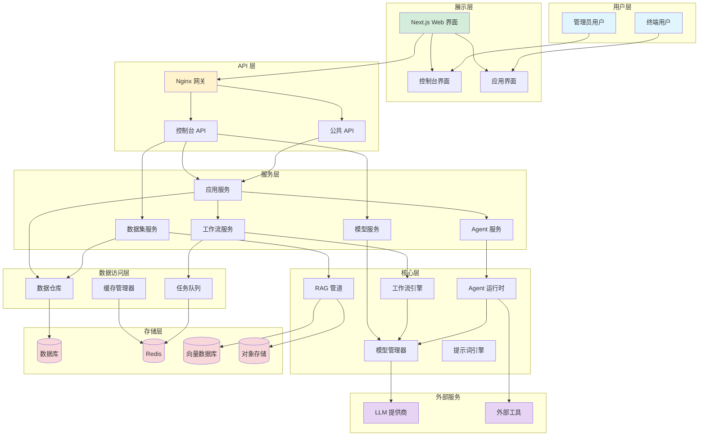
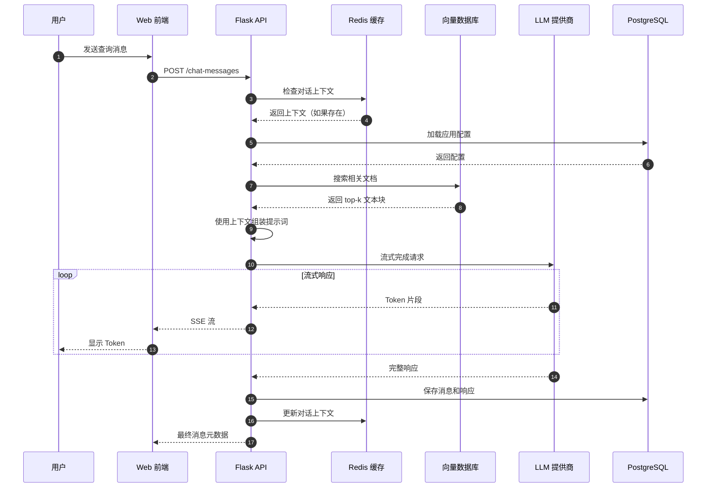
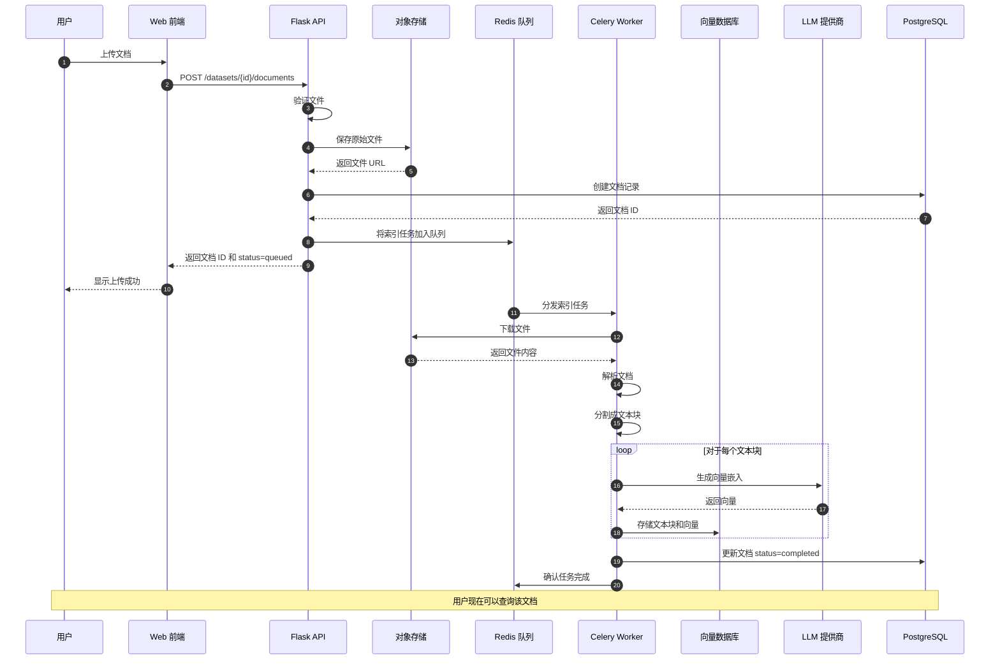
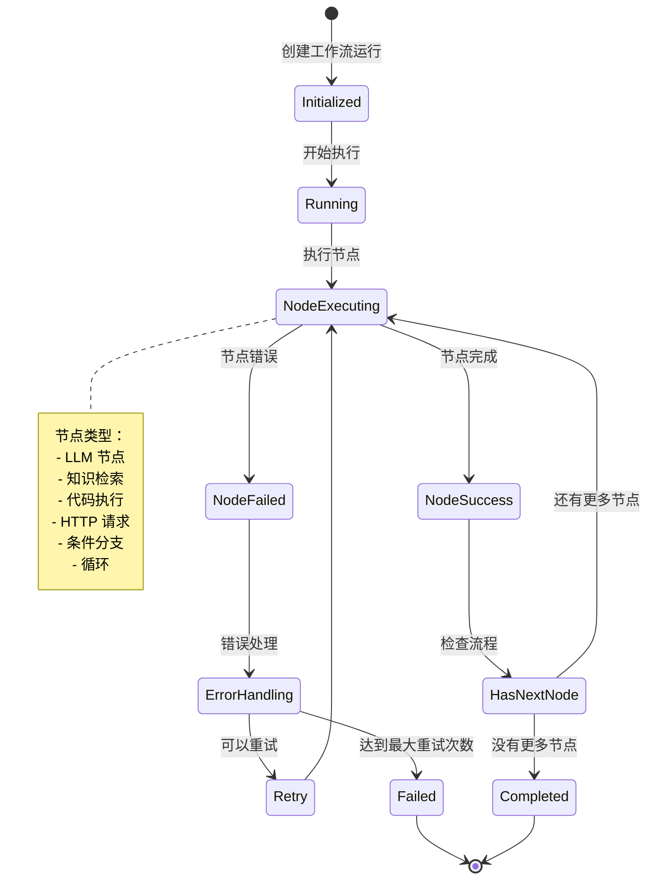
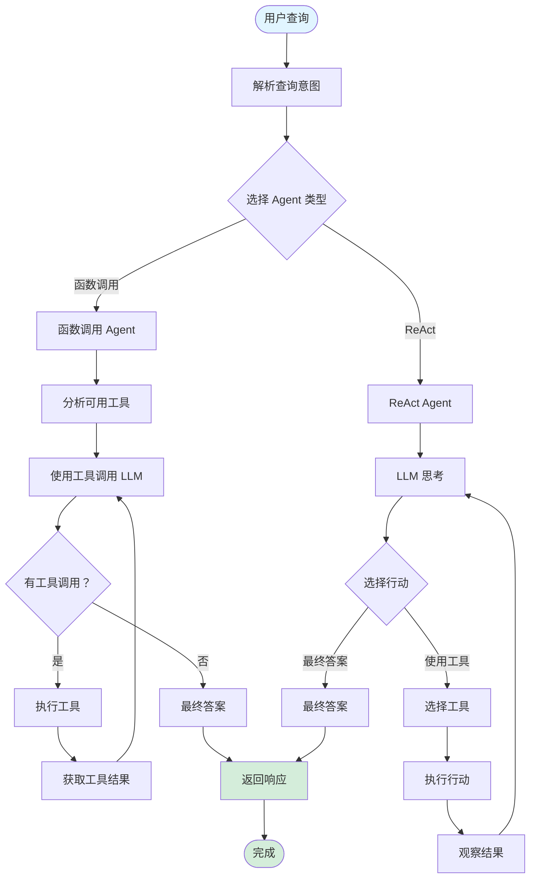
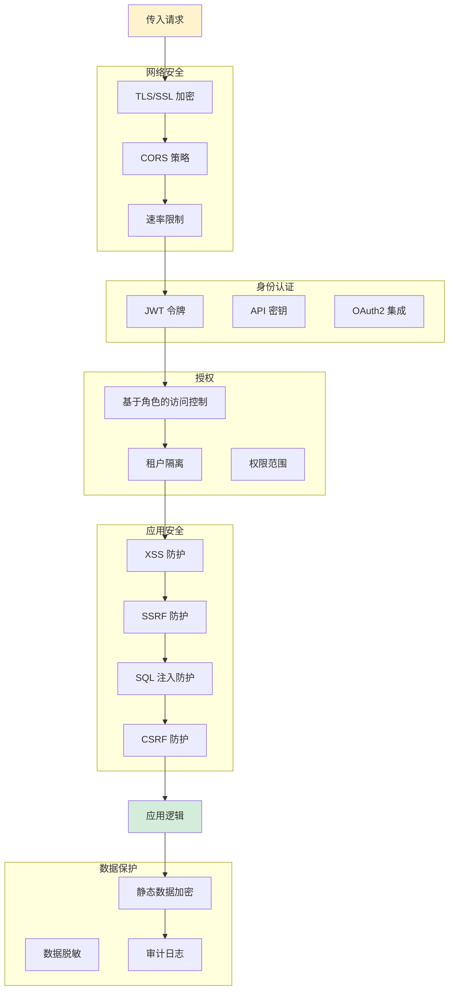

# Dify 架构图

本目录包含 Dify 项目的可视化架构图。

> **English Version** | **英文版本**: [Architecture Diagrams Documentation](../../diagrams/README.md)

## 可用的架构图

### 1. 系统架构
查看完整的系统架构：
- [English Version](../../ARCHITECTURE.md)
- [中文版本](../ARCHITECTURE.md)

### 2. Mermaid 图表

所有图表使用 Mermaid 语法创建，可以在以下环境中查看：
- GitHub（原生支持）
- VS Code（需要 Mermaid 扩展）
- 在线 Mermaid 编辑器

### 3. 组件交互图



### 4. 数据流 - RAG 查询



### 5. 数据流 - 文档索引



### 6. 工作流执行



### 7. Agent 决策流程



### 8. 安全层



## 如何查看

### GitHub
所有 Mermaid 图表在 GitHub 的 Web 界面中自动渲染。

### VS Code
安装 "Markdown Preview Mermaid Support" 扩展：
```
ext install bierner.markdown-mermaid
```

### 在线编辑器
- [Mermaid Live Editor](https://mermaid.live/)
- [Mermaid Chart](https://www.mermaidchart.com/)

## 导出为图片

要将图表导出为 PNG/SVG：

1. 使用 Mermaid CLI：
```bash
npm install -g @mermaid-js/mermaid-cli
mmdc -i diagram.md -o diagram.png
```

2. 使用在线编辑器：
   - 将代码粘贴到 [Mermaid Live Editor](https://mermaid.live/)
   - 点击 "Export" 按钮
   - 选择 PNG 或 SVG 格式

## 贡献

添加新图表时：
1. 使用一致的样式
2. 添加清晰的标签和描述
3. 保持图表专注于特定方面
4. 用新图表描述更新此 README
